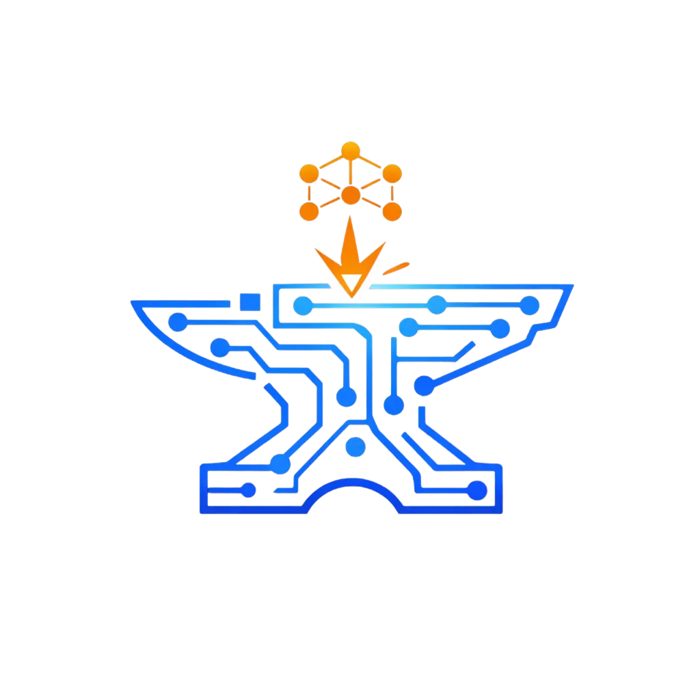

# Agent Forge

<p align="center">
  
</p>

Create production-ready MCP agents in seconds.

Agent Forge is an MCP server that scaffolds complete [Model Context Protocol](https://modelcontextprotocol.io/) agents — each with its own knowledge vault, intelligence layer, LLM client, memory system, planning engine, and activation persona. You describe what the agent should do, and Forge generates everything: source code, tests, config, and setup scripts.

Forge is knowledge-agnostic. It builds the infrastructure — you fill in the expertise.

## Why

Building an MCP agent from scratch means wiring up SQLite, FTS5 search, TF-IDF ranking, circuit breakers, key rotation, facade dispatch, test suites, persona systems, and Claude Code integration. That's hours of boilerplate before you write a single line of domain logic.

Agent Forge eliminates that. One command, one agent — ready to build, test, and activate.

## Quick Start

### 1. Register with Claude Code

```bash
claude mcp add --scope user agent-forge -- node /path/to/agent-forge/dist/index.js
```

### 2. Create an agent

In any Claude Code session, tell Claude what agent you want:

```
I need an agent called Gaudi that advises on backend architecture.
Domains: api-design, database, architecture, security, testing, performance.
Principles: "Security is not optional", "Simple beats clever", "Test everything that can break".
```

Claude will use the `forge` tool to scaffold it. Under the hood:

```
forge op:preview params:{ id: "gaudi", name: "Gaudi", ... }   # See what will be created
forge op:create  params:{ id: "gaudi", name: "Gaudi", ... }   # Scaffold the agent
```

You can also run `forge op:guide` to get a step-by-step creation flow.

### 3. Build and activate

```bash
cd gaudi
./scripts/setup.sh                # Install, build, register with Claude Code
```

Then in a new Claude Code session:

```
Hello, Gaudi!
```

Your agent is live.

### What It Looks Like in Practice

Once Gaudi is active, Claude adopts the persona and has access to all the agent's tools:

```
You:    How should I handle authentication for our REST API?

Gaudi:  [searches vault for auth patterns]
        Based on my security patterns, here's what I recommend:
        - Use short-lived JWTs (15min) with refresh token rotation
        - Store refresh tokens server-side, never in localStorage
        - Add rate limiting on the token endpoint
        I'm capturing this as a pattern for future reference.

You:    We also need to add caching. Can you plan that out?

Gaudi:  [creates a plan with tasks]
        Created plan "Add Caching Layer" with 4 tasks:
        1. Define cache invalidation strategy
        2. Add Redis client configuration
        3. Implement cache middleware
        4. Add cache-related tests
        Approve to start execution?

You:    Goodbye, Gaudi!

Gaudi:  Goodbye! Gaudi persona deactivated.
```

The agent remembers patterns across sessions, learns from your feedback, and builds up domain knowledge over time.

## What Gets Generated

Every agent ships with a complete, tested architecture — and zero pre-loaded knowledge:

```
my-agent/
  src/
    facades/           # MCP tool dispatch (one per domain + core)
    vault/             # SQLite + FTS5 full-text search
    brain/             # TF-IDF intelligence layer
    llm/               # Unified OpenAI/Anthropic client (optional)
    intelligence/      # Domain knowledge (empty JSON bundles)
    identity/          # Agent persona and principles
    activation/        # CLAUDE.md injection + activation flow
    planning/          # Multi-step plan state machine
    __tests__/         # 6 test suites (~220 tests)
  scripts/
    setup.sh           # One-command install, build, register
    copy-assets.js     # Build script for intelligence data
```

### Core Capabilities

| Capability | What It Does |
|---|---|
| **Knowledge Vault** | SQLite-backed storage with FTS5 full-text search and BM25 ranking |
| **Intelligence Layer (Brain)** | TF-IDF hybrid scoring across 5 dimensions, auto-tagging, duplicate detection, adaptive weight tuning |
| **LLM Client** | Unified OpenAI/Anthropic caller with multi-key rotation, per-key circuit breakers, model routing (optional — works without API keys) |
| **Domain Facades** | Each knowledge domain becomes its own MCP tool with search, capture, and pattern ops |
| **Memory System** | Persists session summaries, lessons learned, and preferences across sessions |
| **Session Capture** | PreCompact hook auto-saves session context before Claude compacts memory |
| **Planning Engine** | State machine for multi-step tasks: draft, approve, execute, complete |
| **Export** | Dump vault knowledge back to JSON for version control and sharing |
| **Activation** | Persona-based activation with `Hello!` / `Goodbye!` — injects CLAUDE.md automatically |

### Generated Operations

Each agent exposes two types of MCP tools:

**Domain tools** (`{agent}_{domain}`) — one per knowledge domain:
- `get_patterns` `search` `get_entry` `capture` `remove`

**Core tool** (`{agent}_core`) — shared infrastructure:
- `search` `vault_stats` `list_all` `health` `identity`
- `activate` `inject_claude_md` `setup` `register`
- `memory_search` `memory_capture` `memory_list`
- `session_capture` `export`
- `create_plan` `get_plan` `approve_plan` `update_task` `complete_plan`
- `record_feedback` `rebuild_vocabulary` `brain_stats`
- `llm_status`

Total: `(domains × 5) + 24` operations per agent.

## Forge Operations

Agent Forge itself exposes one MCP tool (`forge`) with 5 ops:

| Op | Purpose |
|---|---|
| `guide` | Step-by-step creation flow for the AI to follow |
| `preview` | See what files and facades will be created |
| `create` | Scaffold the complete agent project |
| `list_agents` | Scan a directory for existing agents |
| `install_knowledge` | Install knowledge packs into an existing agent |

## Installing Knowledge Packs

Agents start empty — but you don't have to populate them one entry at a time. Knowledge packs are pre-built JSON bundles containing patterns, anti-patterns, and rules for specific domains. The `install_knowledge` operation installs them into any existing agent in a single step.

```
forge op:install_knowledge params:{
  agentPath: "/path/to/gaudi",
  bundlePath: "/path/to/knowledge-packs/bundles"
}
```

This will:

1. **Validate** the agent project and all bundle files
2. **Copy** bundle JSON files to `src/intelligence/data/`
3. **Generate facades** for any new domains (matching the agent's architecture — vault+brain or vault-only)
4. **Patch `src/index.ts`** with new imports and facade registrations
5. **Patch `src/activation/claude-md-content.ts`** with new facade table rows
6. **Rebuild** the agent (`npm run build`)

### Bundle Format

Each bundle is a JSON file with this structure:

```json
{
  "domain": "accessibility",
  "version": "1.0.0",
  "entries": [
    {
      "id": "a11y-color-contrast",
      "type": "pattern",
      "domain": "accessibility",
      "title": "Color Contrast Ratios",
      "severity": "critical",
      "description": "Ensure text meets WCAG AA contrast ratio...",
      "tags": ["wcag", "contrast", "color"]
    }
  ]
}
```

Entry fields: `id`, `type` (pattern | anti-pattern | rule), `domain`, `title`, `severity` (critical | warning | suggestion), `description`, `tags[]`. Optional: `context`, `example`, `counterExample`, `why`, `appliesTo[]`.

### Options

| Param | Default | Description |
|---|---|---|
| `agentPath` | required | Absolute path to the target agent project |
| `bundlePath` | required | Path to a bundles directory or a single `.json` file |
| `generateFacades` | `true` | Generate domain facades for new domains |

Set `generateFacades: false` if you only want to update data for existing domains without adding new facades.

### Architecture Detection

The installer automatically detects the agent's architecture:

- **Vault + Brain agents** (have `src/brain/`) — facades use `brain.intelligentSearch()` and `brain.enrichAndCapture()`
- **Vault-only agents** (no `src/brain/`) — facades use `vault.search()` and `vault.add()`

Existing domains get their data files overwritten (upsert). New domains get facades generated, source files patched, and the agent rebuilt.

## Configuration

Agents are defined by a simple config. Domains are free-form — use any kebab-case name that fits your agent's expertise:

```json
{
  "id": "gaudi",
  "name": "Gaudi",
  "role": "Backend Architecture Advisor",
  "description": "Gaudi provides guidance on API design, database patterns, and system architecture.",
  "domains": ["api-design", "database", "architecture", "security", "testing", "performance"],
  "principles": [
    "Security is not optional",
    "Simple beats clever",
    "Test everything that can break"
  ],
  "greeting": "Gaudi here. Let's build something solid.",
  "outputDir": "/Users/you/projects"
}
```

## Development

```bash
npm install
npm run build
npm test              # 56 tests
npm run test:watch    # Watch mode
npm run dev           # Run with tsx (no build needed)
```

### Architecture

Agent Forge is itself an MCP server built on the same patterns it generates:

- **`src/index.ts`** — MCP server entry point, registers the `forge` tool
- **`src/facades/forge.facade.ts`** — Op dispatch for all forge operations
- **`src/scaffolder.ts`** — Core scaffolding logic (preview, create, list)
- **`src/knowledge-installer.ts`** — Knowledge pack installer (validate, copy, generate facades, patch, build)
- **`src/types.ts`** — Config schema and result types (Zod-validated)
- **`src/templates/`** — 27 template generators, each producing a complete source file

### Tech Stack

- TypeScript (ES2022, NodeNext)
- MCP SDK (`@modelcontextprotocol/sdk`)
- Zod for schema validation
- Vitest for testing

Generated agents additionally use:
- better-sqlite3 (vault)
- @anthropic-ai/sdk (LLM client, optional)

## Roadmap

Scaffolding is a one-time act, but agents can be extended post-creation. Knowledge packs (`install_knowledge`) let you inject domain expertise into existing agents. Future improvements:

- **Agent Update (`forge op:update`)** — Upgrade existing agents when new Forge versions add capabilities. Additive-first: new modules (like `src/llm/`) get added without touching existing files. Dependencies get merged into `package.json`. For wired files the user likely edited (`src/index.ts`, core facade), generate an `UPGRADE.md` with exact code snippets instead of overwriting. A `.forgerc` file tracks the scaffolded version to know what's missing.

### Your Agent, Your Roadmap

Each generated agent ships with its own README containing an 8-item improvement roadmap. After scaffolding, the agent belongs entirely to you — no dependency on Agent Forge for future development.

The roadmap covers:

| Improvement | What It Adds |
|---|---|
| **Curator Pipeline** | Background vault maintenance — tag normalization, duplicate merging, quality scoring |
| **Document Intake** | Ingest PDFs, markdown, and text into the vault automatically |
| **Learning Loop** | Turn feedback into measurable improvement — preference profiles, scoring adjustments |
| **Embeddings & Vector Search** | Semantic search via OpenAI embeddings alongside TF-IDF |
| **Cross-Project Memory** | Share knowledge across projects — global pattern pool, unified search |
| **Context Engine** | Intent classification, entity extraction, context-aware retrieval |
| **Proactive Agency** | Anticipate, warn, and suggest without being asked |
| **Plugin System** | Runtime-extensible architecture — load and hot-reload new capabilities |

Each item includes **What**, **Why**, and **How** with specific module names, file paths, and architecture guidance. Your team can pick what matters and build it independently — or ask Claude to implement it using the roadmap as a spec.

## Requirements

- Node.js 18+
- Claude Code (for MCP registration and activation)

## License

MIT
